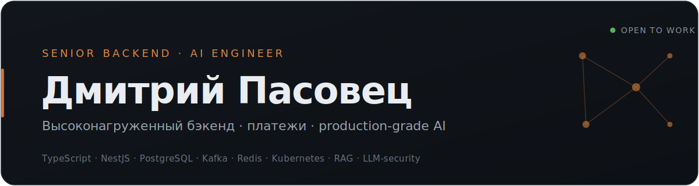

  

  <a href="https://disk.yandex.by/i/9kgdjL2FKScfIQ"><b>Резюме&nbsp;↗</b></a> &nbsp;·&nbsp;
  <a href="https://www.linkedin.com/in/dimacaptain"><b>LinkedIn&nbsp;↗</b></a> &nbsp;·&nbsp;
  <a href="https://career.habr.com/dimacaptain"><b>Хабр&nbsp;Карьера&nbsp;↗</b></a> &nbsp;·&nbsp;
  <a href="https://t.me/captainDima"><b>Telegram&nbsp;↗</b></a>

---

**Senior Backend-разработчик (Node.js / NestJS), 5+ лет.** Веду бэкенд от архитектуры до прода: проектирование под нагрузку, платежи и подписки, распределённые транзакции, отказоустойчивость. Последние 3 года работаю на стыке backend и AI: мультиагентные пайплайны, RAG, LLM-security как ежедневный рабочий инструмент.

**Из практики:**

- Спроектировал 6-слойную защиту от prompt injection (OWASP LLM Top 10): санитизация вход/выход, LLM-based risk scoring, outbound content gate, PII/secret redaction.
- Спроектировал и реализовал order book биржи с атомарным матчингом (Redlock + распределённые транзакции), price-time priority (FIFO), двусторонней синхронизацией PostgreSQL и Redis через BullMQ и восстановлением стакана при сбоях Redis; архитектура под высокую нагрузку, нагрузочные тесты на 10k пользователей.
- Интегрировал платёжные системы (App Store, Google Play, CloudPayments) в агрегатор Adapty: миграция подписок, отказоустойчивая обработка вебхуков и транзакций; плюс автоматизировал фискализацию кассовых чеков (CloudKassir).
- Снизил долю новых багов на 80% на highload-проекте после перепроектирования флоу (Kafka, Debezium). Нашёл и починил баг «вечных подписок» (2000+) с восстановлением потерянных транзакций.
- Беклидил проекты (2–3 разработчика в подчинении): оценка скоупа, event storming, звонки с бизнесом; проводил собеседования и вёл стажировки на уровне компании.

---

### Стек

|  |  |
| :-- | :-- |
| **Языки** | TypeScript, JavaScript (Node.js), SQL; базово Python |
| **Core & Backend** | Node.js, NestJS, Express, Fastify, REST, GraphQL, gRPC, WebSocket, Multithreading/Async, микросервисы |
| **Архитектура** | Microservices, Event-Driven, DDD, CQRS, Unit of Work, распределённые транзакции, идемпотентность, SOLID, проектирование под нагрузку и отказоустойчивость |
| **Брокеры сообщений** | RabbitMQ, Apache Kafka (+ Debezium/Connect), BullMQ, Google Pub/Sub |
| **Базы данных / хранилища** | PostgreSQL (TypeORM, Prisma, Knex+Objection, RawSQL), MongoDB (Mongoose), Redis (кэш, очереди, rate-limit, Redlock, Pub/Sub), S3 |
| **Cloud & DevOps** | Docker, Kubernetes (Lens, ArgoCD, HPA), GitLab CI/CD, Nginx, AWS (S3, SNS), Google Cloud / Firebase, Yandex Cloud, VPS |
| **Observability & Testing** | Prometheus, Grafana/Loki, Sentry, Kowl, unit/integration/e2e-тесты, Jest |
| **Security** | JWT (access/refresh/sessions), OAuth 2.0/2.1, 2FA, RBAC, rate-limiting, КриптоПро, HSM, OWASP, OWASP LLM Top 10, server hardening (fail2ban, UFW, sysctl) |
| **AI & Tools** | LLM-оркестрация, RAG, мультиагентные системы, pgvector, Qdrant, embeddings (Ollama, bge-m3), MCP-серверы, OpenRouter, prompt-инжиниринг, Claude Code, Cursor |
| **Прочее** | Git, Linux, Scrum/Kanban, event storming, код-ревью, оценка и декомпозиция задач |

---

### Проекты

**Мультиагентная система разработки**
Команды агентов Claude Code (Arch / Dev / QA, пары Main/Rev на разных LLM) в tmux-конвейере: авто-ревью, переключение модельных профилей, дашборд состояния агентов, детерминированный autoapprove-хук (Claude Code PreToolUse) с deny-list политикой. Idempotent-инсталляция (symlinks, cron), репозиторий как single source of truth, bats-тесты. Основной рабочий инструмент разработки.
`TypeScript` · `tmux` · `Claude Code` · `PreToolUse hooks` · `multi-model routing`

**Квант**
Распределённый персональный AI-ассистент: Telegram ↔ Claude Code через CCR с полным доступом к инструментам (веб-поиск, файлы, код, зрение). Два инстанса, локальный и облачный (VPS), с общей git-памятью (vault local / cloud / shared, автосинк) и системой из 8 доменных ролей, мультипользовательский доступ.
`Node.js` · `CCR` · `Claude Code` · `git-based memory` · `MCP`

**Zipper**
AI-тьютор для ускоренного обучения: Next.js 15 и RAG на локальных эмбеддингах (Ollama, bge-m3) с векторным поиском (SQLite, sqlite-vec), Vercel AI SDK. Несколько режимов тьюторинга (сократовский диалог, опрос, mock-экзамен), ingest-конвейер учебных материалов (PDF / EPUB / FB2, транскрипции лекций), трекинг прогресса освоения.
`Next.js 15` · `TypeScript` · `RAG` · `sqlite-vec` · `Ollama / bge-m3` · `Vercel AI SDK`

---

  

